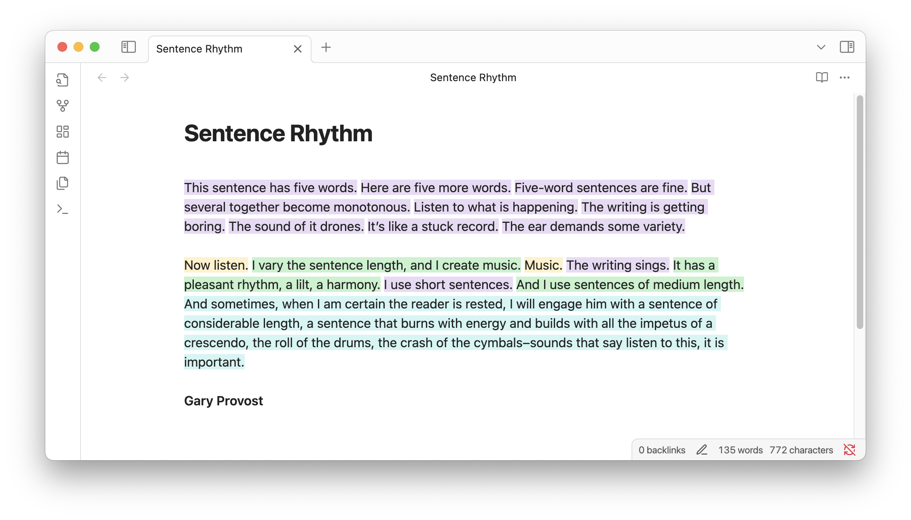

# Sentence Rhythm Plugin for Obsidian

Inspired by [Gary Provost's advice on varying sentence length](https://www.aerogrammestudio.com/2014/08/05/this-sentence-has-five-words/), this plugin toggle colored highlights on and off to quickly see sentence length variety in your writing. 

## How to use

Once the plugin is installed you can toggle the highlighting on and off from the command palette or plugin settings. 

## Customization

From the plugin settings you can customize the size thresholds for each category (extra short, short, medium, long, extra long) and the colors used for each. 

### Advanced customization

When active, the plugin applies one of the following CSS classes to each sentence depending on its length, which can be customized in your user stylesheet. 

* .sentence-length-xs
* .sentence-length-sm
* .sentence-length-md
* .sentence-length-lg
* .sentence-length-xl
